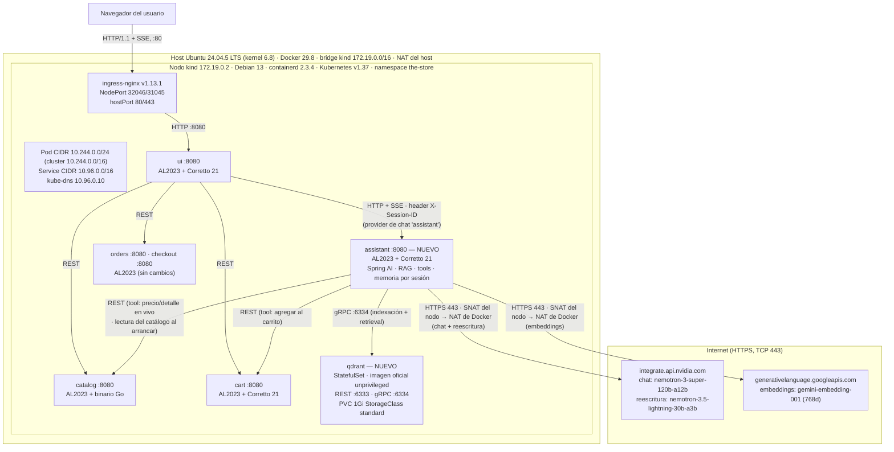

# Arquitectura (actualización de la pre-entrega)

> Este documento **reemplaza la sección 4 ("Diagrama de arquitectura") de
> [`preentrega.md`](./preentrega.md)**, que no se edita porque es el contrato
> aprobado por la cátedra. El desvío se justifica en el `design.md` del change
> `add-assistant-service` (decisión D8).

## Qué cambió respecto de la pre-entrega

- **No se despliega Ollama** ni su PVC de modelos. Con la autorización de la
  cátedra para usar modelos en la nube, el chat va a NVIDIA
  (`integrate.api.nvidia.com`, API compatible con OpenAI) y los embeddings a la
  Gemini API de Google (`generativelanguage.googleapis.com`, modelo
  `gemini-embedding-001`, 768 dimensiones).
- **Modelo de embeddings:** `gemini-embedding-001` (768 dimensiones, coseno)
  en lugar de `nomic-embed-text` en Ollama. Se mantienen Qdrant, las 768
  dimensiones y la distancia coseno de la pre-entrega. El desvío se justifica
  en la decisión D10 del `design.md` del change `add-product-indexing`.
- **Aparece tráfico saliente**: solo desde el pod `assistant`, por HTTPS (TCP
  443), hacia esos dos destinos. El resto de los servicios, Qdrant incluido
  (con la telemetría desactivada), sigue sin tráfico hacia afuera del cluster.
- La arquitectura de la sección 2 no cambia: el `assistant` sigue siendo el
  único servicio que habla con el LLM y con Qdrant. Solo se reemplaza el
  runtime del modelo.
- Motivo: en un nodo kind solo con CPU, `llama3.2:3b` tarda decenas de segundos
  por respuesta y su tool calling es poco confiable, lo que pone en riesgo los
  casos de uso de razonamiento, comparación y function calling del scope.

## Diagrama



## Red

| Elemento | Valor |
|---|---|
| Red bridge Docker `kind` | `172.19.0.0/16` — gateway/host `172.19.0.1`, nodo `172.19.0.2` |
| Pod CIDR / Service CIDR | `10.244.0.0/16` (nodo: `10.244.0.0/24`) / `10.96.0.0/16` |
| DNS | kube-dns `10.96.0.10`, dominio `cluster.local` (UDP/TCP 53). Los nombres externos se reenvían al resolver del nodo (`forward . /etc/resolv.conf` en el Corefile), que usa el DNS embebido de Docker |
| Ingress | ingress-nginx v1.13.1, `Service` LoadBalancer, NodePorts 32046 (HTTP) / 31045 (HTTPS), publicados en el host como hostPort 80/443. Solo enruta hacia la `ui`: el `assistant` y Qdrant no se exponen |
| Almacenamiento | StorageClass `standard` (`rancher.io/local-path`, `WaitForFirstConsumer`) para el PVC de Qdrant (vectores, 1 GiB, `volumeClaimTemplates` del StatefulSet). Ya no hay PVC de Ollama |
| Sistemas operativos | Host: Ubuntu 24.04.5 LTS (kernel 6.8) · Nodo `kind`: Debian 13 (containerd 2.3.4) · Contenedores de la app: Amazon Linux 2023 (Qdrant usa su imagen oficial `unprivileged`) |
| Protocolos | HTTP/1.1 REST entre servicios (`ClusterIP`, puerto 80 → 8080 del contenedor) · SSE (`text/event-stream`) navegador ↔ `ui` y `ui` ↔ `assistant` · gRPC 6334 `assistant` → Qdrant (REST 6333 para probes y debug) · HTTPS 443 `assistant` → proveedores en la nube |
| Tráfico hacia afuera del cluster | Solo desde el pod `assistant`, HTTPS (TCP 443) hacia `integrate.api.nvidia.com` (chat) y `generativelanguage.googleapis.com` (embeddings con `gemini-embedding-001`, que reemplaza a `nomic-embed-text` de la pre-entrega: ver la decisión D10 del `design.md` de `add-product-indexing`). Consumo de cuota de Gemini (100 RPM y 1.000 requests por día, independiente de la de NVIDIA): 1 a 3 requests en el primer arranque (el catálogo se embebe en lotes de hasta 100 productos), 0 en los reinicios sin cambios en el catálogo, 1 por búsqueda no cacheada (las consultas repetidas salen de un caché en memoria) y 0 por productos similares (se calculan en Qdrant con el vector ya guardado). Camino: pod (`10.244.0.0/24`) → SNAT/masquerade del nodo kind (`172.19.0.2`) → bridge Docker `kind` → NAT del host → internet. DNS: pod → kube-dns (`10.96.0.10`) → `forward` al resolver del nodo → DNS embebido de Docker. Ningún otro servicio sale a internet en operación (Qdrant corre con `QDRANT__TELEMETRY_DISABLED=true`). Credenciales en el Secret `assistant-api-keys`, nunca versionado |

## Verificación de la salida a internet

Verificado el 2026-10-06 con `./local.sh rebuild-cluster` (kind v0.33.0,
Kubernetes v1.37.0) en una máquina del grupo con macOS y Docker Desktop 28.0.1.
Ahí la red `kind` es `172.23.0.0/16` (nodo `172.23.0.2`) y el resolver del nodo
es el de Docker Desktop (`192.168.65.254`); en el host Ubuntu de la tabla de
arriba son `172.19.0.0/16` y el DNS embebido de Docker. El camino es el mismo.

```bash
kubectl exec -n the-store deploy/assistant -- \
  curl -sS -o /dev/null -w '%{http_code}' https://integrate.api.nvidia.com/v1/models
kubectl exec -n the-store deploy/assistant -- \
  curl -sS -o /dev/null -w '%{http_code}' https://generativelanguage.googleapis.com/
```

| Destino | Respuesta | Qué muestra |
|---|---|---|
| `https://integrate.api.nvidia.com/v1/models` | HTTP `200` (≈0,5 s) | DNS externo, TCP 443 y TLS OK |
| `https://generativelanguage.googleapis.com/` | HTTP `404` (≈1 s) | DNS externo, TCP 443 y TLS OK (la raíz no es un endpoint de la API; el `404` lo devuelve Google) |

Camino observado en el cluster:

1. **DNS:** el `/etc/resolv.conf` del pod apunta a kube-dns (`nameserver
   10.96.0.10`, `search the-store.svc.cluster.local svc.cluster.local
   cluster.local`, `ndots:5`). El Corefile de CoreDNS tiene `forward .
   /etc/resolv.conf`, es decir, reenvía los nombres que no son del cluster al
   resolver del nodo kind, que es el DNS de Docker.
2. **Ruteo:** la ruta por defecto del pod sale por `eth0` hacia el gateway
   `10.244.0.1` (el nodo).
3. **SNAT en el nodo:** la cadena `KIND-MASQ-AGENT` de la tabla `nat` del nodo
   devuelve (`RETURN`) el tráfico hacia `10.244.0.0/16` y aplica `MASQUERADE` a
   todo el resto. La conexión sale con la IP del nodo en la red `kind`.
4. **NAT de Docker:** el bridge `kind` (gateway `172.x.0.1`) hace un segundo
   NAT hacia la interfaz del host, y de ahí a internet.
