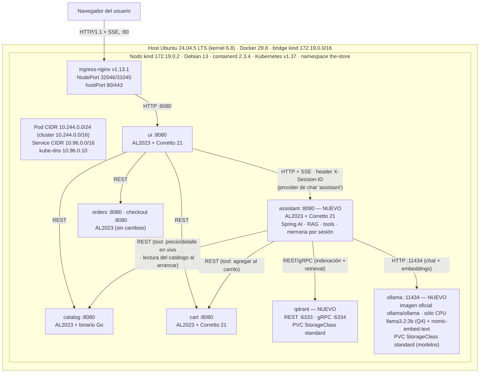

# Pre-entrega TPE — Tema 9: Asistente Inteligente de Compras con GenAI

**Redes de Información — ITBA — 2C 2026**
**Grupo [N]** — [Integrante 1], [Integrante 2], [Integrante 3]

---

## 1. Problemática y contexto

**The Store** es un e-commerce de microservicios desplegado en Kubernetes: `ui` (Java 21 / Spring Boot, WebFlux + Thymeleaf), `catalog` (Go / Gin), `cart` y `orders` (Java / Spring Boot) y `checkout` (NestJS). El descubrimiento de productos tiene hoy dos limitaciones concretas:

- **Búsqueda sólo léxica.** `GET /catalog/products` filtra únicamente por `tags` exactos, con orden por precio y paginación. No hay búsqueda semántica ni tolerancia a sinónimos o errores de tipeo: una consulta que no comparte palabras literales con un producto no lo encuentra.
- **Chat sin conocimiento de la tienda.** La UI ya expone un chat (`POST /chat/submit`, streaming SSE, Spring AI 1.0.0), pero es sólo un *system prompt* de personaje: no conoce el catálogo, no recuerda turnos anteriores y no puede actuar sobre otros servicios.

**Objetivo:** convertir ese chat en un **asistente de compras con GenAI** que busque semánticamente, responda con datos reales del catálogo, razone sobre comparaciones y actúe sobre los microservicios (agregar al carrito). El modelo se ejecuta **de forma local, dentro del propio cluster** (Llama sobre Ollama, sólo CPU), sin depender de APIs cloud.

## 2. Diseño de la solución

- **Componente `assistant` (nuevo microservicio).** Java 21 + Spring Boot + Spring AI, desplegado en el namespace `the-store` como un servicio más (puerto 8080, `Service` ClusterIP), al mismo nivel que `catalog`, `cart` y `orders`. Concentra toda la lógica GenAI y es el único servicio que habla con Ollama y con Qdrant: indexación de productos, retrieval, armado de prompts (incluida la persona «A.G.E.N.T.», que hoy vive en la configuración de la UI), memoria por sesión y *tools* contra los microservicios. Cambiar de modelo o de vector store impacta sólo a este servicio. La UI sigue siendo sólo presentación y las fallas o la carga del LLM quedan aisladas en su propio servicio.
- **Runtime del modelo: Ollama en un pod, sólo CPU.** Ollama corre como un `Deployment` propio en el namespace `the-store`, publicado por un `Service` ClusterIP `ollama` (puerto 11434) que el `assistant` resuelve por DNS (`ollama.the-store.svc.cluster.local`) como a cualquier otro servicio. No depende de una GPU ni de software instalado en el host, por lo que el despliegue es reproducible con `kind` + `kubectl apply` en cualquier máquina. En el primer arranque el pod descarga los modelos (`ollama pull`) a un PVC de la StorageClass `standard` montado en `/root/.ollama`, de modo que los reinicios posteriores no repiten la descarga, y un `readinessProbe` lo marca disponible recién cuando ambos modelos están presentes. Modelos: **Llama 3.2 3B Instruct (cuantización Q4)** para generación, razonamiento y *tool calling* (~2 GB de RAM), y **nomic-embed-text** (768 dimensiones) para embeddings, ambos servidos por la misma instancia.
- **Vector store: Qdrant.** Desplegado en el cluster (`Deployment` + `Service` + PVC de la StorageClass `standard`). Una colección de productos (768 dimensiones, distancia coseno) con payload `{id, name, price, tags}`, que habilita filtros híbridos (rango de precio, tags). El `assistant` lo consulta con el starter oficial de Spring AI (REST 6333 / gRPC 6334).
- **Indexación de productos.** Cuando el `assistant` se levanta, lee el catálogo real por API (`GET /catalog/size` y luego `GET /catalog/products?size=<total>`, dado que el endpoint pagina de a 10 por defecto), extrae `tags[].name`, calcula el embedding de `name + description + tags` con `nomic-embed-text` (el mismo modelo con el que embebe las consultas) y hace *upsert* en Qdrant. Al leer de la API, el índice vectorial refleja exactamente lo que sirve el catálogo, y `catalog` no se acopla a Ollama ni a Qdrant.
- **Contrato UI ↔ `assistant`.** Nuevo *provider* de chat en la UI, `assistant` (`AssistantChatConfig` + `AssistantChatModel`, mismo patrón que los providers existentes `openai`, `bedrock` y `mock`; se activa con `retail.ui.chat.provider=assistant`). `ChatController` obtiene la sesión con `SessionIDUtil.getSessionId(request)` y la transmite en un `ChatOptions` propio; el provider la envía como header `X-Session-ID` en `POST /chat` (body `{"message": "..."}`, respuesta `text/event-stream`). El `assistant` expone además `GET /products/{id}/similar?k=` (vecinos más cercanos en Qdrant) para la ficha de producto. El front (`chat.js`) no cambia: `SessionIDWebFilter` ya traduce la cookie `SESSIONID` al header `X-Session-ID`.
- **Identidad y memoria.** El `X-Session-ID` es el mismo identificador que la aplicación ya usa como `customerId` contra `cart`. El `assistant` lo usa como clave de la memoria conversacional (ventana de turnos, en memoria) y como `customerId` en la tool de carrito, de modo que lo que el asistente agrega aparece en el carrito que muestra la UI.
- **Tools (function calling).** Tres herramientas expuestas al modelo: búsqueda con filtros estructurados (tags y orden de `GET /catalog/products`, más rango de precio como filtro de payload en Qdrant), detalle y precio en vivo (`GET /catalog/products/{id}`) y agregar al carrito (`POST /carts/{customerId}/items`).

## 3. Scope del POC y casos de uso

Implementamos los bloques **1 a 4** de capacidades del asistente (embeddings → LLM chico con RAG → LLM mediano con razonamiento → function calling). Catálogo, UI y persona del chat están en inglés, por lo que los ejemplos de consulta también.

| Bloque | Caso de uso | Criterio de aceptación en la demo |
|---|---|---|
| **1. Embeddings** | Búsqueda semántica | *"something to escape a chase without being seen"* devuelve ≥3 productos reales del catálogo, sin coincidencia léxica exacta |
| **1. Embeddings** | Productos similares | La ficha de producto muestra los k vecinos más cercanos, coherentes con el producto |
| **1. Embeddings** | Tolerancia a typos y sinónimos | *"umbrela with a grapling hok"* encuentra el mismo producto que la grafía correcta |
| **2. LLM chico (RAG)** | Respuesta con productos reales | La respuesta menciona sólo productos existentes, con su precio real y enlace a su ficha |
| **2. LLM chico (RAG)** | Query rewriting previo al retrieval | El retrieval mejora de forma observable respecto de buscar la consulta cruda |
| **3. LLM mediano** | Comparación justificada | Compara dos productos con criterios explícitos (precio, atributos), no sólo «elegí el A» |
| **3. LLM mediano** | Conversación multi-turno | Ante *"cheaper"* o *"not a vehicle"*, mantiene el contexto del turno anterior usando `X-Session-ID` |
| **4. Function calling** | Agregar al carrito desde el chat | Llama a `POST /carts/{customerId}/items` y el carrito de la UI lo refleja |
| **4. Function calling** | Precio y detalle en vivo | Consulta `GET /catalog/products/{id}` en lugar de leer el dato del vector store |
| **4. Function calling** | Filtros estructurados | Traduce categoría y presupuesto del lenguaje natural a filtros reales (tags y orden de la API, rango de precio en Qdrant) |

**Transversales dentro del scope:** streaming de tokens de punta a punta (navegador ↔ `ui` ↔ `assistant` ↔ Ollama, todo SSE) y citado de fuentes (cada producto mencionado linkea a su ficha `/catalog/{id}`, lo que permite verificar que no hay alucinaciones).

## 4. Diagrama de arquitectura

| Elemento | Valor |
|---|---|
| Red bridge Docker `kind` | `172.19.0.0/16` — gateway/host `172.19.0.1`, nodo `172.19.0.2` |
| Pod CIDR / Service CIDR | `10.244.0.0/16` (nodo: `10.244.0.0/24`) / `10.96.0.0/16` |
| DNS | kube-dns `10.96.0.10`, dominio `cluster.local` (UDP/TCP 53) |
| Ingress | ingress-nginx v1.13.1, `Service` LoadBalancer, NodePorts 32046 (HTTP) / 31045 (HTTPS), publicados en el host como hostPort 80/443 |
| Almacenamiento | StorageClass `standard` (`rancher.io/local-path`, `WaitForFirstConsumer`) para los PVC de Qdrant (vectores) y de Ollama (modelos) |
| Sistemas operativos | Host: Ubuntu 24.04.5 LTS (kernel 6.8) · Nodo `kind`: Debian 13 (containerd 2.3.4) · Contenedores de la app: Amazon Linux 2023 (Ollama y Qdrant usan sus imágenes oficiales) |
| Protocolos | HTTP/1.1 REST entre servicios (`ClusterIP`, puerto 8080) · SSE (`text/event-stream`) navegador ↔ `ui` y `ui` ↔ `assistant` · HTTP 11434 `assistant` → Ollama · REST 6333 / gRPC 6334 → Qdrant |
| Tráfico hacia afuera del cluster | En operación, ninguno: todo el tráfico de la aplicación, incluido el de Ollama, es interno. Sólo la descarga inicial de los modelos desde el registro de Ollama en el primer arranque del pod |

## 5. Alternativas consideradas

| Decisión | Alternativa descartada | Por qué se descarta |
|---|---|---|
| Dónde vive el asistente | Extender el `ChatController` de la UI | Mezcla presentación con inteligencia, sin contrato de API explícito entre componentes ni aislamiento de fallas; carga de LLM/RAG en un servicio que ya sirve páginas |
| Dónde vive el asistente | Servicio nuevo en Python (FastAPI + LangChain/LlamaIndex) | Suma un cuarto lenguaje al repo (ya hay Java, Go y Node) y se aleja de Spring AI, que es la tecnología nombrada por el tema |
| Runtime del modelo | Ollama nativo en el host, con GPU | Aprovecha la RTX 3050 Ti sin passthrough, pero exige instalar Ollama en el host y exponerlo (`OLLAMA_HOST=0.0.0.0`, firewall), fijar a mano la IP del bridge (`172.19.0.1`) en un `Service` sin selector + `EndpointSlice` y contar con una GPU NVIDIA: el despliegue deja de ser reproducible con sólo `kind` + `kubectl apply` |
| Runtime del modelo | Ollama en un pod con GPU passthrough | Requiere passthrough anidado (host → Docker → containerd del nodo `kind` → pod), `nvidia-container-toolkit`, `extraMounts` y device plugin, y sólo funciona en máquinas con GPU NVIDIA: contradice el objetivo de portabilidad |
| Runtime del modelo | Ollama como sidecar (o dentro del mismo contenedor) del `assistant` | Reiniciar o escalar el `assistant` recargaría o duplicaría el modelo en RAM, y se pierde el aislamiento de memoria entre el LLM y la lógica de negocio |
| Runtime del modelo | llama.cpp directo, sin Ollama | Más control de bajo nivel, pero Ollama aporta gestión de modelos y API HTTP lista, lo que reduce el riesgo operativo |
| Modelo | Modelos de 7–8B como base | Sin GPU, la generación en CPU sería demasiado lenta para una demo interactiva y ocuparían varios GB más de RAM en el nodo |
| Vector store | pgvector | Ningún servicio de The Store usa PostgreSQL: habría que desplegar una base relacional completa sólo para la extensión |
| Vector store | Qdrant + pgvector con comparativa | Duplica la indexación y los puntos de falla en la demo, sin justificar el contenido extra |
| Indexación | Que `catalog` calcule los embeddings y escriba en Qdrant al arrancar | Duplica en Go la lógica de embeddings y el esquema del vector store, y acopla `catalog` a Ollama y a Qdrant: cambiar de modelo o de vector store obligaría a modificar dos servicios en dos lenguajes. El `assistant` es el único dueño de ambas dependencias |
| Contrato UI ↔ assistant | API compatible OpenAI (`base-url`) | Igualmente exige modificar `ChatController` para propagar la sesión, y depende de que la librería externa permita pasar `X-Session-ID` |
| Contrato UI ↔ assistant | Proxy intermedio | Una capa más sin nada que desacoplar: ambos extremos son componentes propios |
| IA | API cloud gestionada (OpenAI, Bedrock) | Ya soportada por la UI, pero con costo variable y contraria al espíritu del tema (modelos locales) |
| Recuperación | Catálogo completo en el prompt, sin vector store | Es el bloque 6 (fuera de scope); no escala con el tamaño del catálogo y no demuestra embeddings |
| Búsqueda | Mejorar con SQL `LIKE` / Elasticsearch, sin GenAI | Resuelve parte del descubrimiento pero no cumple la consigna del tema |

**Riesgos y mitigaciones.** *Latencia del modelo local (sólo CPU):* streaming de tokens, modelo 3B cuantizado, contexto de retrieval acotado (pocos productos por consulta) y precarga del modelo antes de la demo; si una prueba de banco de tokens/segundo o de *tool calling* no alcanza, se evaluará un modelo más chico (p. ej. Llama 3.2 1B). *Memoria del nodo:* el `Deployment` de Ollama fija un límite de memoria propio, para que el modelo no compita con los servicios Java del nodo. *Alucinaciones del modelo chico:* RAG con datos reales y citado de fuentes. *Memoria efímera:* el historial vive en memoria del `assistant` y se pierde si el pod se reinicia, el mismo criterio que hoy tiene el carrito.
