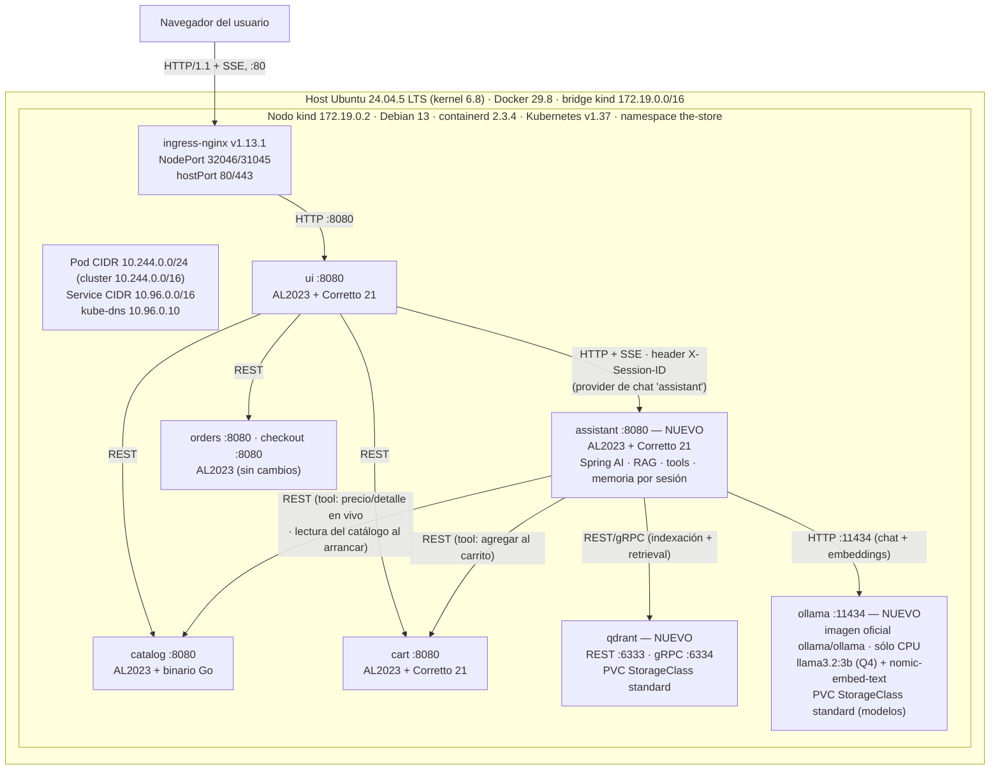

# Pre-entrega TPE — Tema 9: Asistente Inteligente de Compras con GenAI

**Redes de Información — ITBA — 2C 2026**

**Grupo [3]** — [Ardenghi, Filipo - 64306], [Bassi, Santiago - 64643], [Testoni, Ezequiel 64709]

---

## 1. Problemática y contexto

**The Store** es un e-commerce de microservicios desplegado en Kubernetes con los siguientes servicios:

* UI - Java + Spring Boot, WebFlux + Thymeleaf
* Catalog - Go / Gin
* Cart - Java + Spring Boot
* Orders - Java + Spring Boot
* Checkout - Nest JS

El descubrimiento de productos tiene hoy dos limitaciones concretas:

* **Búsqueda sólo léxica.** `GET /catalog/products` filtra únicamente por tags exactos, con orden por precio y paginación. No hay búsqueda semántica ni tolerancia a sinónimos o errores de tipeo: una consulta que no comparte palabras literales con un producto no lo encuentra.
* **Chat sin conocimiento de la tienda.** La UI ya expone un chat (`POST /chat/submit`, streaming SSE), pero es sólo un system prompt ficticio: no conoce el catálogo, no recuerda sesiones anteriores y no puede actuar sobre otros servicios.

El objetivo es convertir ese chat en un asistente de compras con GenAI que busque semánticamente, responda con datos reales del catálogo, razone sobre comparaciones y actúe sobre los microservicios (agregar al carrito). El modelo se ejecuta de forma local.

## 2. Diseño de la solución

* **Componente `assistant`, nuevo microservicio.** Desarrollado en Java 21 con Spring Boot y Spring AI, desplegado en el namespace `the-store` como un servicio más en el puerto 8080 con Service ClusterIP, al mismo nivel que `catalog`, `cart` y `orders`. Concentra toda la lógica GenAI y es el único servicio que se comunica con `ollama` y con `qdrant`: indexación de productos, retrieval, armado de prompts, incluida la persona A.G.E.N.T. que hoy reside en la configuración de la UI, memoria por sesión y tools contra los microservicios. Cambiar de modelo o de vector store impacta únicamente a este servicio. La `ui` continúa siendo sólo presentación, por lo que las fallas o la carga del LLM quedan aisladas en su propio servicio.
* **Runtime del modelo: `Ollama` en un pod.** `ollama` corre como un Deployment propio en el namespace `the-store`. Se va a experimentar con diferentes modelos para generación, razonamiento y tool calling, para luego determinar qué modelo queda en producción.
* **Vector store: `Qdrant`.** Se define una colección de productos de 768 dimensiones con distancia coseno y payload con atributos id, name, price y tags, lo que habilita filtros híbridos como rango de precio y tags. Es consultado por el servicio `assistant`.
* **Indexación de productos.** Al iniciar el servicio, `assistant` consulta el catálogo real. Luego extrae el nombre de los tags, calcula el embedding de la concatenación de nombre, descripción y tags con un modelo como, por ejemplo, modelo `nomic-embed-text`.
* **Contrato UI con `assistant`.** Se incorpora un nuevo provider de chat en la `ui` denominado `assistant`.
* **Herramientas de Function Calling.** Se exponen tres herramientas al modelo de lenguaje: búsqueda con filtros estructurados que combina tags y ordenamiento de `GET /catalog/products` junto con filtros de rango de precio sobre el payload en `qdrant`, consulta de detalle y precio en tiempo real mediante `GET /catalog/products/{id}`, e incorporación de productos al carrito mediante `POST /carts/{customerId}/items`.

## 3. Scope del POC y casos de uso

Se implementarán las siguientes capacidades del asistente, abarcando desde embeddings, modelo compacto con RAG, modelo intermedio con razonamiento y function calling.

| Caso de uso | Criterio de aceptación en la demo |
|---|---|
| Búsqueda semántica | "*something to escape a chase without being seen*" devuelve al menos 3 productos reales del catálogo, sin coincidencia léxica exacta |
| Productos similares | La ficha de producto muestra los k vecinos más cercanos y coherentes con el producto |
| Tolerancia a errores de tipeo y sinónimos | "*umbrela with a grapling hok*" encuentra el mismo producto que la grafía correcta |
| Reescritura de consulta previa al retrieval | La recuperación de información mejora de forma observable respecto de buscar la consulta cruda |
| Comparación justificada | Compara dos productos con criterios explícitos de precio y atributos, evitando respuestas simplistas |
| Conversación multi-turno | Ante expresiones como "*cheaper*" o "*not a vehicle*", mantiene el contexto del turno anterior utilizando |
| Agregar al carrito desde el chat | Invoca `POST /carts/{customerId}/items` y el carrito de la interfaz refleja los cambios |
| Precio y detalle en tiempo real | Consulta `GET /catalog/products/{id}` en lugar de tomar el valor estático del vector store |
| Filtros estructurados | Traduce la categoría y el presupuesto expresados en lenguaje natural a filtros reales de tags y orden en la API y rango de precio en `Qdrant` |

## 4. Diagrama de arquitectura

| Elemento | Valor |
|---|---|
| Red bridge Docker `kind` | `172.19.0.0/16` — gateway/host `172.19.0.1`, nodo `172.19.0.2` |
| Pod CIDR / Service CIDR | `10.244.0.0/16` (nodo: `10.244.0.0/24`) / `10.96.0.0/16` |
| DNS | kube-dns `10.96.0.10`, dominio `cluster.local` (UDP/TCP 53) |
| Ingress | ingress-nginx v1.13.1, `Service` LoadBalancer, NodePorts 32046 (HTTP) / 31045 (HTTPS), publicados en el host como hostPort 80/443 |
| Almacenamiento | StorageClass `standard` (`rancher.io/local-path`, `WaitForFirstConsumer`) para los PVC de Qdrant (vectores) y de Ollama (modelos) |
| Sistemas operativos | Host: Ubuntu 24.04.5 LTS (kernel 6.8) · Nodo `kind`: Debian 13 (containerd 2.3.4) · Contenedores de la app: Amazon Linux 2023 (Ollama y Qdrant usan sus imágenes oficiales) |
| Protocolos | HTTP/1.1 REST entre servicios (`ClusterIP`, puerto 8080) · SSE (`text/event-stream`) navegador ↔ `ui` y `ui` ↔ `assistant` · HTTP 11434 `assistant` → Ollama · REST 6333 / gRPC 6334 → Qdrant |
| Tráfico hacia afuera del cluster | En operación, ninguno: todo el tráfico de la aplicación, incluido el de Ollama, es interno. Sólo la descarga inicial de los modelos desde el registro de Ollama en el primer arranque del pod |

## 5. Alternativas consideradas

| Decisión | Alternativa descartada | Por qué se descarta |
|---|---|---|
| Dónde vive el asistente | Servicio nuevo en Python con FastAPI y LangChain | Incorpora un cuarto lenguaje al repositorio que ya contiene Java, Go y Node, alejándose además de Spring AI que es la tecnología designada para el trabajo. |
| Runtime del modelo | Ollama como sidecar dentro del pod de `assistant` | Reiniciar o escalar horizontalmente el servicio assistant duplicaría o recargaría innecesariamente el modelo en memoria RAM, perdiendo aislamiento de recursos. |
| Runtime del modelo | Uso de llama.cpp directo sin Ollama | Brinda mayor control de bajo nivel pero carece de la gestión integral de modelos y de la API HTTP lista que aporta Ollama, incrementando el riesgo operativo. |
| Vector store | pgvector sobre PostgreSQL | Ningún servicio de The Store utiliza PostgreSQL, por lo que requeriría desplegar y mantener una base de datos relacional completa únicamente para esta funcionalidad. |
| Proceso de indexación | Indexación directa desde `catalog` hacia Ollama y Qdrant | Acopla el microservicio de catálogo a la infraestructura de inteligencia artificial y duplica en Go la lógica de embeddings y el esquema que Spring AI gestiona nativamente. |
| Contrato UI con `assistant` | API compatible con OpenAI mediante `base-url` | Exige modificar de igual forma el ChatController para propagar la sesión y depende de que la librería externa admita cabeceras personalizadas como `X-Session-ID`. |
| Mecanismo de búsqueda | Búsqueda tradicional por SQL LIKE o Elasticsearch sin GenAI | Resuelve únicamente búsquedas sintácticas pero no aporta comprensión semántica ni tolerancia a intenciones complejas del usuario. |

